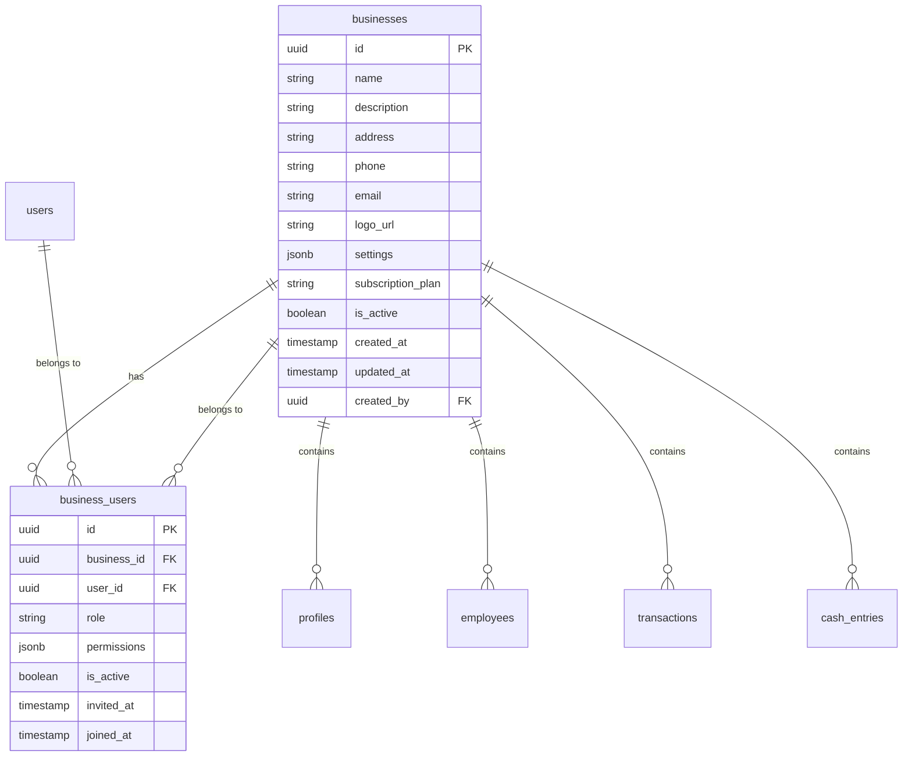

# Multi-Tenant Migration Guide

## 🏢 Overview

This migration transforms the Junkshop Management System from a single-tenant to a multi-tenant architecture, allowing multiple scrap trading businesses or junkshops to use the same system while keeping their data completely isolated.

## 📋 Migration Steps

### 1. **Database Migration**

Run the migration script in your Supabase SQL Editor:

```sql
-- Copy and paste the contents of:
-- supabase/migrations/20250121_multi_tenant_migration.sql
```

This migration will:
- ✅ Create `businesses` table for multi-tenant support
- ✅ Add `business_id` to all existing tables
- ✅ Create `business_users` junction table for user-business relationships
- ✅ Create `business_invitations` table for inviting users
- ✅ Update all RLS policies for business isolation
- ✅ Create helper functions for business management
- ✅ Migrate existing data to a default business

### 2. **Frontend Updates**

#### A. Update App.tsx to include BusinessProvider

```typescript
// src/App.tsx
import { BusinessProvider } from './presentation/hooks/useBusinessContext';

function App() {
  return (
    <AuthProvider>
      <BusinessProvider>
        {/* Your existing app content */}
      </BusinessProvider>
    </AuthProvider>
  );
}
```

#### B. Add Business Switcher to Header

```typescript
// src/presentation/components/UserHeader.tsx
import BusinessSwitcher from './BusinessSwitcher';

// Add to your header component:
<BusinessSwitcher 
  onCreateBusiness={() => setView('create-business')}
  onManageBusiness={(business) => setView('manage-business')}
/>
```

### 3. **Update Data Services**

All data services now automatically filter by `business_id`. The existing code will work without changes because:

- ✅ **Automatic business_id assignment**: Triggers automatically set `business_id` for new records
- ✅ **RLS policies**: Database-level filtering ensures users only see their business data
- ✅ **Backward compatibility**: Existing data is migrated to a default business

### 4. **Business Management Features**

#### Create New Business
```typescript
import { businessService } from './infrastructure/services/BusinessService';

const businessId = await businessService.createBusiness({
  name: "ABC Scrap Trading",
  description: "Professional scrap metal trading",
  address: "123 Main St, City",
  phone: "+1234567890",
  email: "contact@abcscrap.com"
});
```

#### Invite Users
```typescript
const invitationId = await businessService.inviteUserToBusiness(
  businessId,
  "employee@abcscrap.com",
  "employee"
);
```

#### Switch Business Context
```typescript
import { useBusinessContext } from './presentation/hooks/useBusinessContext';

const { switchBusiness } = useBusinessContext();
await switchBusiness(newBusinessId);
```

## 🏗️ Architecture Changes

### Database Schema



### Data Isolation

- **Row Level Security (RLS)**: All queries automatically filter by user's business
- **Business Context**: Users can switch between businesses they belong to
- **Automatic Assignment**: New records automatically get the current business_id

## 🔐 Security Features

### 1. **Business Isolation**
- Users can only see data from businesses they belong to
- RLS policies enforce business-level data separation
- No cross-business data leakage possible

### 2. **Role-Based Access**
- **Owner**: Full control over business and all data
- **Manager**: Can manage employees and transactions
- **Employee**: Can create transactions and view relevant data
- **Viewer**: Read-only access to business data

### 3. **Invitation System**
- Secure token-based invitations
- 7-day expiration for invitations
- Email-based invitation system

## 📊 Business Features

### 1. **Business Management**
- Create and manage multiple businesses
- Business settings and configuration
- Subscription plan management
- Logo and branding customization

### 2. **User Management**
- Invite users to businesses
- Role-based permissions
- User activity tracking
- Bulk user management

### 3. **Data Analytics**
- Business-specific reporting
- Cross-business analytics (for owners with multiple businesses)
- Performance metrics per business

## 🚀 Usage Examples

### For Business Owners

1. **Create Business**
   ```typescript
   const business = await businessService.createBusiness({
     name: "My Scrap Business",
     description: "Local scrap metal trading"
   });
   ```

2. **Invite Employees**
   ```typescript
   await businessService.inviteUserToBusiness(
     business.id,
     "employee@example.com",
     "employee"
   );
   ```

3. **Manage Multiple Businesses**
   ```typescript
   const { userBusinesses, switchBusiness } = useBusinessContext();
   // Switch between businesses in the UI
   ```

### For Employees

1. **Accept Invitation**
   ```typescript
   await businessService.acceptBusinessInvitation(invitationToken);
   ```

2. **Work Within Business Context**
   - All transactions, employees, and cash entries are automatically scoped to current business
   - No changes needed to existing workflows

## 🔄 Migration Checklist

- [ ] Run database migration script
- [ ] Update App.tsx with BusinessProvider
- [ ] Add BusinessSwitcher to header
- [ ] Test business creation and switching
- [ ] Test user invitations
- [ ] Verify data isolation
- [ ] Update any custom queries to include business_id
- [ ] Test all existing functionality

## 🐛 Troubleshooting

### Common Issues

1. **"User does not have access to this business"**
   - Ensure user is added to business_users table
   - Check if business_user.is_active = true

2. **Data not showing after business switch**
   - Verify RLS policies are working
   - Check if business_id is set correctly

3. **Invitation not working**
   - Check invitation token expiration
   - Verify email matches invitation email

### Debug Queries

```sql
-- Check user's business access
SELECT b.name, bu.role, bu.is_active 
FROM business_users bu
JOIN businesses b ON b.id = bu.business_id
WHERE bu.user_id = auth.uid();

-- Check business data isolation
SELECT COUNT(*) FROM transactions WHERE business_id = 'your-business-id';
```

## 📈 Benefits

- ✅ **Scalability**: Support unlimited businesses
- ✅ **Data Isolation**: Complete separation between businesses
- ✅ **User Management**: Role-based access control
- ✅ **Flexibility**: Users can belong to multiple businesses
- ✅ **Security**: RLS policies ensure data protection
- ✅ **Backward Compatibility**: Existing data preserved

## 🎯 Next Steps

1. **Business Onboarding**: Create guided setup for new businesses
2. **Advanced Analytics**: Cross-business reporting for enterprise users
3. **API Access**: Business-specific API keys and rate limiting
4. **White-labeling**: Custom branding per business
5. **Integration**: Connect with external business tools

This migration provides a solid foundation for a multi-tenant scrap trading management system that can scale to serve multiple businesses while maintaining data security and isolation.


